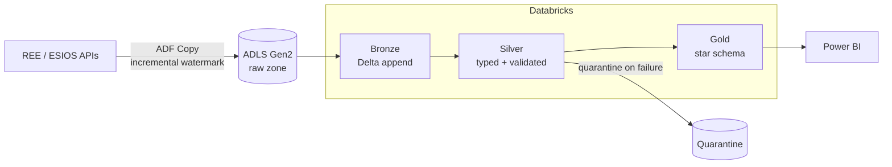

# Spain Energy Lakehouse

End-to-end Azure lakehouse over the Spanish electricity market: hourly prices, demand and
generation mix ingested from REE/ESIOS public APIs, processed through a Medallion
architecture on Databricks, and served as a star schema to Power BI.


> **Status: scaffold / in active development.** The repository structure, architecture
> design and infrastructure skeletons are in place; pipeline implementation is being
> built phase by phase. See [Roadmap](#roadmap) for what is real today.

## What this demonstrates

A data platform built the way a technology consultancy delivers one for a client:

- **Ingestion** — Azure Data Factory parametrized Copy pipelines with incremental
  watermark loads and retry policies, landing raw JSON in ADLS Gen2.
- **Processing** — Azure Databricks (PySpark + Delta Lake) implementing Medallion
  Bronze → Silver → Gold layers.
- **Data quality** — validation expectations enforced at the Silver boundary, with
  quarantine tables for rejected records.
- **Serving** — dimensional star schema in Gold, consumed by a Power BI report.
- **Engineering practice** — Terraform IaC, GitHub Actions CI, dev/prod separation,
  architecture decision records, and explicit cloud cost tracking.

## Data sources

| Source | Content | Cadence | Auth |
|---|---|---|---|
| [REE apidatos](https://www.ree.es/es/apidatos) | Demand, generation mix, CO₂ emissions | Hourly/daily | None |
| [ESIOS](https://www.esios.ree.es/es/pagina/api) | PVPC prices, market indicators | Hourly | Free token |

## Architecture



Full design: [docs/architecture.md](docs/architecture.md) · Phase plans: [docs/plan/](docs/plan/README.md)
· Decisions: [docs/adr/](docs/adr/) · Cost tracking: [docs/cost-tracking.md](docs/cost-tracking.md)

## Repository layout

```
adf/                 Azure Data Factory pipeline definitions (JSON)
databricks/          PySpark notebooks by medallion layer (bronze/ silver/ gold/)
infra/terraform/     IaC for resource group, ADLS, ADF, Databricks workspace
src/                 Shared Python utilities (typed, tested)
streaming/           Phase E1: Kafka + Spark Structured Streaming extension
docs/                Architecture, ADRs, cost tracking
tests/               pytest suite mirroring src/
```

## Getting started

```powershell
git clone https://github.com/gonzalonao/spain-energy-lakehouse.git
cd spain-energy-lakehouse
uv sync          # install pinned dependencies into a virtual env
uv run pytest    # run the test suite
```

Cloud deployment (requires an Azure subscription and an ESIOS token):

```powershell
cd infra\terraform
terraform init
terraform plan -var-file="environments\dev.tfvars"
```

## Roadmap

- [x] Repository scaffold: structure, architecture design, IaC/CI skeletons
- [ ] Phase A — ADF ingestion: REE + ESIOS → ADLS raw, incremental watermarks
- [ ] Phase B — Databricks Bronze/Silver with data-quality expectations + quarantine
- [ ] Phase C — Gold star schema + Power BI report
- [ ] Phase D — CI/CD hardening: dev/prod environments, deployment gates
- [ ] Phase E1 — Streaming: REE 10-min real-time demand → Kafka → Spark Structured Streaming
- [ ] Phase E2 — ML price forecasting on the Gold layer
- [ ] Phase E3 — AEMET weather enrichment

## Author

**Gonzalo López Crespo** — [LinkedIn](https://linkedin.com/in/gonzalolopezcrespo) · [GitHub](https://github.com/gonzalonao)
