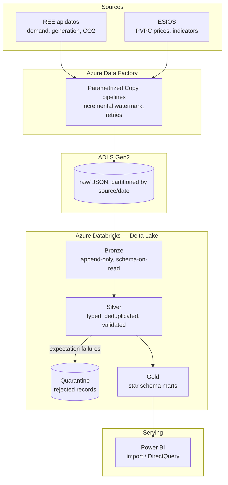

# Architecture

## Overview

The platform follows a Medallion lakehouse architecture on Azure, mirroring the reference
delivery pattern used by consultancies for analytics platforms: managed ingestion (ADF),
open-format storage (Delta on ADLS Gen2), compute decoupled from storage (Databricks),
and a governed dimensional serving layer (Power BI).

## Layer contracts

| Layer | Purpose | Rules |
|---|---|---|
| raw | Exact API responses | Immutable; partitioned `source=/ingest_date=`; never read by BI |
| Bronze | Raw → Delta, append-only | No transformations beyond metadata columns (`_ingested_at`, `_source_file`) |
| Silver | Clean, typed, conformed | Explicit schema; dedup on natural keys; quality expectations enforced; failures → quarantine, never dropped silently |
| Gold | Business-ready marts | Star schema (`fact_energy_hourly`, `dim_date`, `dim_technology`, `dim_zone`); no raw identifiers |

## Incremental loading

Each ADF pipeline maintains a **watermark** (last successfully loaded interval end) in a
control table. A run requests only `[watermark, now)` from the API, writes to raw, and
advances the watermark only after a successful Databricks Bronze load — making reruns
idempotent and gap-free.

## Data quality

Expectations run at the Bronze → Silver boundary:

- schema conformity (types, required fields)
- domain checks (prices ≥ 0, demand within physical bounds, valid technology codes)
- freshness (latest interval within expected lag)

Records failing expectations land in a quarantine Delta table with the failure reason;
a run fails loudly if the rejection ratio exceeds a threshold.

## Environments

Two isolated environments (`dev`, `prod`) via Terraform workspaces and per-environment
`.tfvars`. CI deploys to `dev` on merge to `develop`; `prod` deploys are tag-triggered
from `main`.

## Streaming extension (Phase E1)

REE publishes real-time national demand at 10-minute cadence. The extension adds:
producer (Python) → Kafka topic (local Redpanda for dev; Azure Event Hubs Kafka
endpoint documented for cloud) → Spark Structured Streaming job → Bronze streaming
Delta table, merged into the same Silver model — a lambda-style unification of batch
and streaming on one lakehouse.

## Design decisions

Recorded as ADRs in [adr/](adr/). Key decisions so far:

- [ADR-0001](adr/0001-medallion-on-azure-databricks.md) — Medallion on Azure Databricks
- [ADR-0002](adr/0002-cost-strategy-free-tiers.md) — Cost strategy under a student budget
